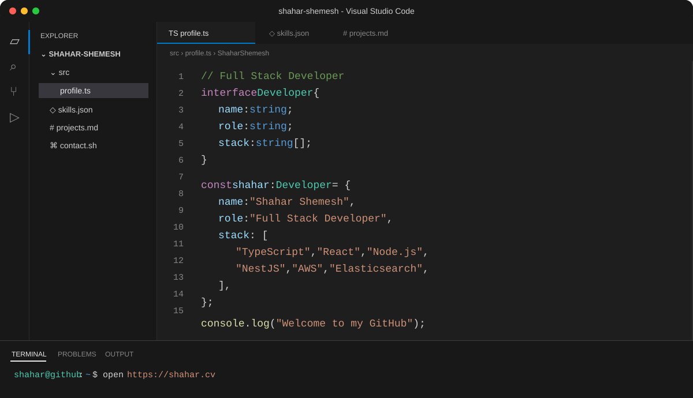

<div align="center">



<br />

<a href="https://shahar.cv"></a>
<a href="https://www.linkedin.com/in/shaharshemesh"></a>
<a href="mailto:shahar@usa.com"></a>

</div>

## `about-me.ts`

```ts
const aboutMe = {
  name: "Shahar Shemesh",
  role: "Full Stack Developer",
  education: "B.Sc. in Computer Science",
  focus: ["Web platforms", "Backend systems", "Admin tools", "ETL processes"],
  interests: ["Code", "Technology", "Music", "Gadgets", "Coffee"],
};
```

## `skills.json`

```json
{
  "languages": ["TypeScript", "JavaScript", "Python", "C++", "C", "Java"],
  "frontend": ["React", "Redux", "Angular", "HTML", "CSS", "Tailwind CSS"],
  "backend": ["Node.js", "NestJS", "Django", "Flask"],
  "databases": ["PostgreSQL", "MySQL", "MongoDB", "Elasticsearch"],
  "tools": ["AWS", "Docker", "Git", "GitHub Actions"]
}
```

## `featured-projects.md`

<table>
<tr>
<td width="50%" valign="top">

### [my-vscode-theme-portfolio](https://github.com/shahar-shemesh/my-vscode-theme-portfolio)

A React and TypeScript portfolio designed around a custom VS Code interface.

</td>
<td width="50%" valign="top">

### [askMeAnything](https://github.com/shahar-shemesh/askMeAnything)

A Dockerized Flask application using OpenAI and PostgreSQL.

</td>
</tr>
<tr>
<td width="50%" valign="top">

### [sunshine-food-app](https://github.com/shahar-shemesh/sunshine-food-app)

A full stack food ordering application built with React and Node.js.

</td>
<td width="50%" valign="top">

### [gadish-suite](https://github.com/shahar-shemesh/gadish-suite)

A responsive React application for presenting a vacation rental.

</td>
</tr>
</table>

## `github-stats.ts`

<div align="center">


</div>

## `contact.sh`

```bash
open "https://shahar.cv"
open "https://www.linkedin.com/in/shaharshemesh"
mailto "shahar@usa.com"
```
